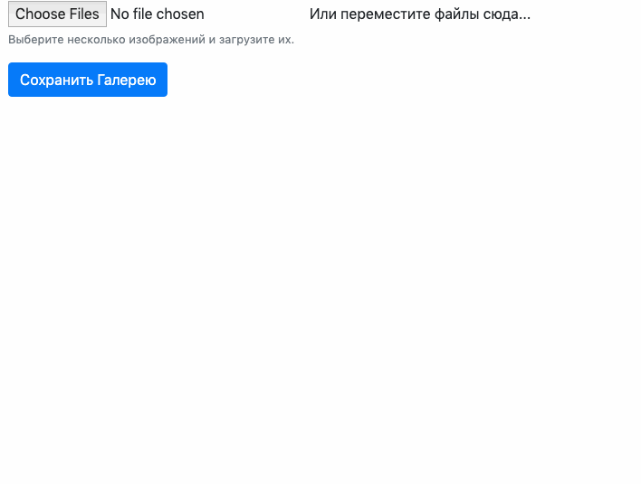
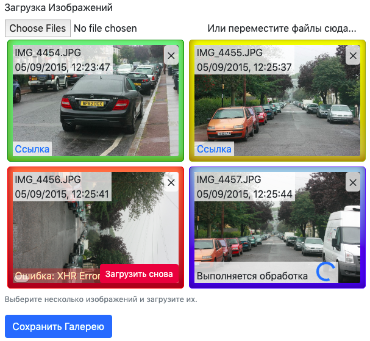

# photo-uploader

[](https://npmjs.org/package/photo-uploader)

`photo-uploader` is The _Preact_ JSX Photo Uploader Component. This is a beta pre-release with the package not available in English (internalisation will follow soon). The component depends on Bootstrap styles (the skins will follow soon too, just trying to figure out how to do those things).

```sh
yarn add photo-uploader
```



## Table Of Contents

- [Table Of Contents](#table-of-contents)
- [API](#api)
- [`PhotoUploader()`](#photouploader-void)
  * [`_photoUploader.Props`](#type-_photouploaderprops)
- [Server Response](#server-response)
- [Copyright](#copyright)

<p align="center"><a href="#table-of-contents"></a></p>

## API

The package is available by importing its default component:

```js
import photoUploader from 'photo-uploader'
```

The package has been compiled into `h`-pragma calls (without JSX) using [ÀLaMode](https://artdecocode.com/alamode/) transpiler, and the CSS imports are changed into importing a CSS injector script. See the [build](build) folder to see how it looks. The `import/export` statements are left as they are though, and the recommended usage of the package is to bundle it with [_Depack_](https://artdecocode.com/depack/) &mdash; the front-end bundler that uses _Google Closure Compiler_.

<p align="center"><a href="#table-of-contents"></a></p>

## `PhotoUploader(): void`

Creates an area with an input to choose files, and a drag-and-drop zone. As soon as photos are added, their previews are generated on a small canvas, to prevent using too much memory to display heavy pictures, and metadata is read to display the date when the photo was taken.

In future releases, the previews will also be rotated according to the orientation from the metadata.

```jsx
/* eslint-env browser */
import { render, Component } from 'preact'
import PhotoUploader from 'photo-uploader'
import 'preact/devtools/'

class Main extends Component {
  render() {
    return (
      <div className="container">
        Hello World
        <PhotoUploader uploadUri="/form" />
      </div>)
  }
}

render(<Main />, document.querySelector('#preact'))
```

__<a name="type-_photouploaderprops">`_photoUploader.Props`</a>__: The photo uploader will create preview elements for each photo and have a hidden input field populated with the `photoId` received when the photo was updated.

|      Name       |              Type               |                                            Description                                            |
| --------------- | ------------------------------- | ------------------------------------------------------------------------------------------------- |
| onRemove        | <em>function(): void</em>       | The function to call when a photo was removed.                                                    |
| onAdded         | <em>function(): void</em>       | The function to call when a photo was added.                                                      |
| fieldName       | <em>string</em>                 | The name of the hidden `input` fields. Default `files[]`.                                         |
| onPhotoUploaded | <em>function(Object): void</em> | The callback to call when a photo was uploaded with the `result` property of the server response. |
| uploadedResults | <em>string</em>                 | The list of photos which were saved and don't need uploading.                                     |
| __uploadUri*__  | <em>string</em>                 | The URL where to upload files.                                                                    |

When photos are uploaded to the URL provided, their read the `photoId` from the JSON response and add it to the hidden id field provided. The parent form (which is not implemented by this component) can then be used to save the ids of saved pictures to the server. The implementation intentionally decouples uploading photos from saving them on the server, so that it is possible to upload them to a route which is different from the business-logic server that would save the photo into appropriate category (_etc_) which would also be present in the form implemented by the page.



There are 6 states of the photo:

- <kbd>added</kbd> Just dropped to the component, needs to start uploading [grey].
- <kbd>uploading</kbd> Started the upload process [blue].
- <kbd>error</kbd> Upload failed, there's a button to retry [red].
- <kbd>processing</kbd> The upload has completed, waiting for the server to finish processing (resizing, metadata, _etc_) [blue].
- <kbd>ready</kbd> Ready to be saved [yellow].
- <kbd>saved</kbd> The photo was saved via the form, it's id is present in the `uploadedResults` property of the component, and it won't be saved again [green].

<p align="center"><a href="#table-of-contents"></a></p>

## Server Response

The component expects to receive a JSON response with 3 properties: `error`, `result` and `photoId`. The photo ID will be stored in the hidden input field, so that the parent form can send it, unless it's already included in the `uploadedResults` property which should be maintained by the parent form also. The result is the `SRC` of the uploaded image, which will replace the canvas-generated preview. It could be rotated according to metadata or watermarked _etc_. The error will be shown in the notification of the preview.

<p align="center"><a href="#table-of-contents"></a></p>


## Copyright

(c) [Demimonde][1] 2019

[1]: https://demimonde.cc

<p align="center"><a href="#table-of-contents"></a></p>